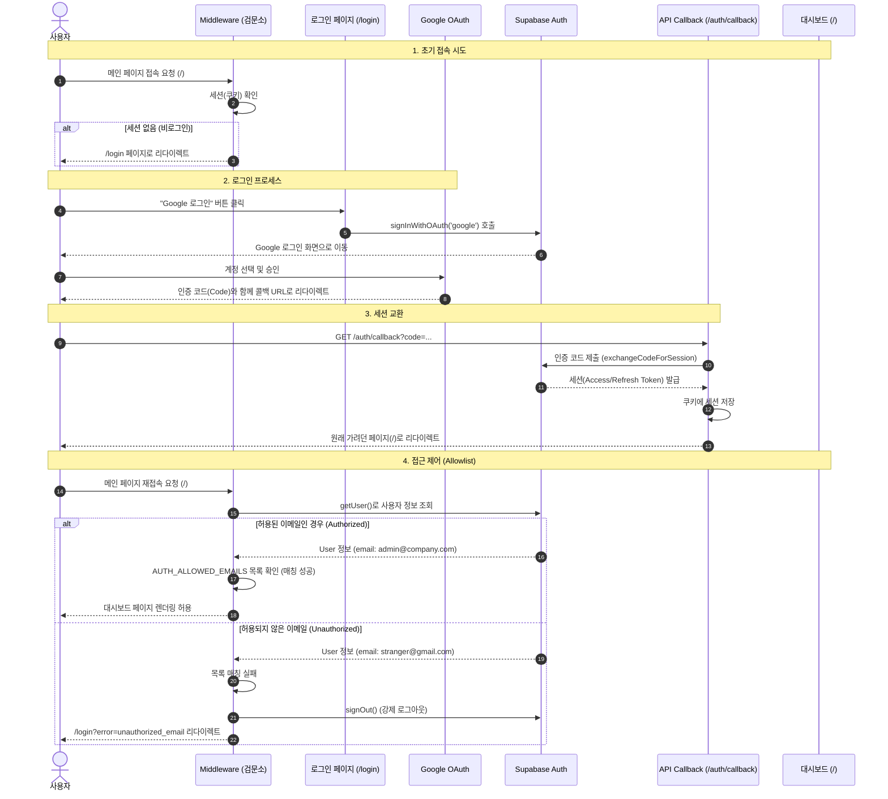

# Google 로그인 및 접근 제어 (Allowlist) 구현 문서

본 문서는 프로젝트에 적용된 **Google OAuth 로그인** 및 **특정 이메일 허용(Allowlist)** 로직의 동작 원리와 설정을 설명합니다.

## 1. 개요 (Overview)

이 시스템은 **Next.js App Router**, **Supabase Auth**, **Middleware**를 조합하여 구현되었습니다.
모든 페이지 접근 요청은 Middleware가 가로채어 인증 상태와 권한을 즉시 검증합니다.

- **인증 프로바이더**: Google (OAuth 2.0)
- **세션 관리**: Supabase Auth (Cookie 기반)
- **보안 정책**:
  - 비로그인 사용자 → `/login` 리다이렉트
  - 로그인 사용자 중 허용되지 않은 이메일 → 강제 로그아웃 및 차단

## 2. 동작 흐름 (Sequence Diagram)



## 3. 주요 구성 파일

| 파일 경로                        | 역할                                                                                 |
| -------------------------------- | ------------------------------------------------------------------------------------ |
| `src/middleware.ts`              | Next.js 미들웨어 진입점. 모든 요청을 1차 필터링합니다.                               |
| `src/lib/supabase/middleware.ts` | 실제 인증 로직. 토큰 갱신, 로그인 여부 확인, **이메일 Allowlist 검사**를 수행합니다. |
| `src/lib/supabase/server.ts`     | 서버 컴포넌트/API용 Supabase 클라이언트.                                             |
| `src/lib/supabase/client.ts`     | 클라이언트 컴포넌트용 Supabase 클라이언트.                                           |
| `src/app/login/page.tsx`         | 로그인 UI. 로그인 버튼 클릭 시 Supabase 인증을 트리거합니다.                         |
| `src/app/auth/callback/route.ts` | OAuth 인증 후 돌아오는 요청을 처리하여 세션 쿠키를 굽는 API입니다.                   |

## 4. 환경 변수 설정 (.env)

시스템이 정상 작동하려면 아래 환경 변수가 설정되어야 합니다.

```bash
# Supabase 연결 설정
NEXT_PUBLIC_SUPABASE_URL="https://[PROJECT-ID].supabase.co"
NEXT_PUBLIC_SUPABASE_ANON_KEY="[ANON-KEY]"

# 접근 허용 리스트 (공백 없이 쉼표로 구분)
AUTH_ALLOWED_EMAILS="admin@example.com,user@example.com"
```

## 5. Supabase 대시보드 설정

1.  **Authentication** > **Providers** > **Google** 활성화.
2.  **Authentication** > **URL Configuration** > **Site URL**을 `http://localhost:3000` (배포 시 도메인)으로 설정.
3.  **Authentication** > **URL Configuration** > **Redirect URLs**에 `http://localhost:3000/auth/callback` 추가.
