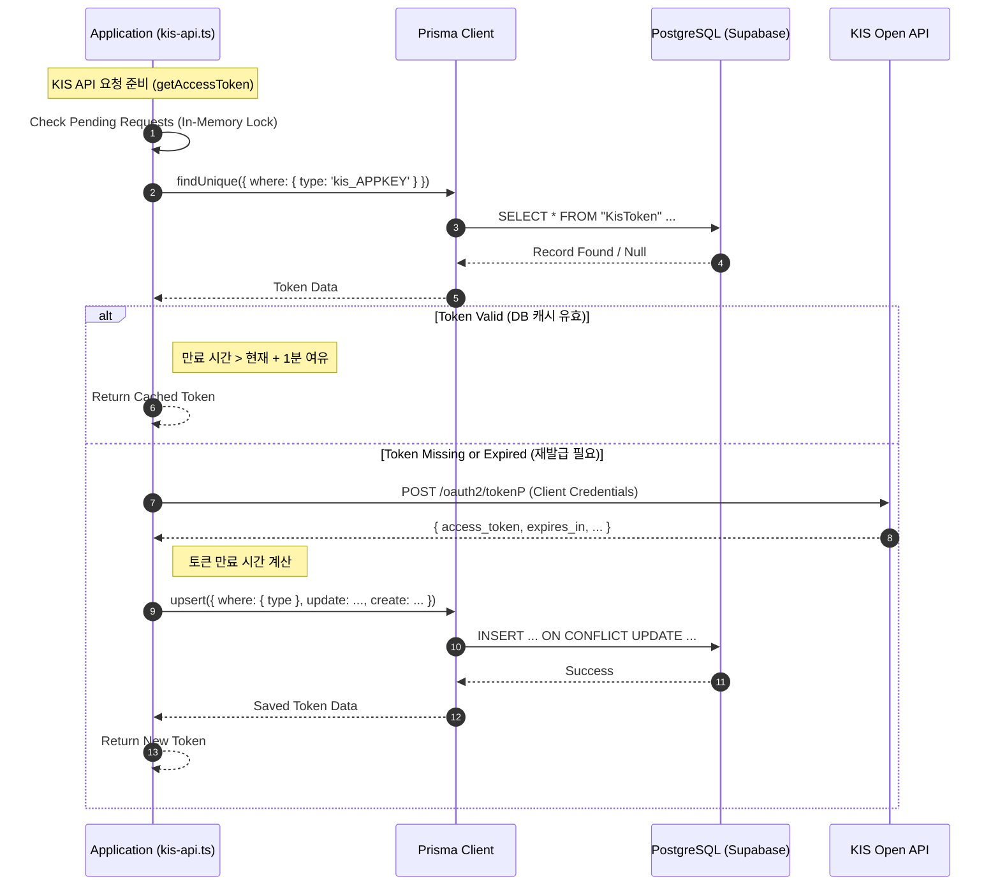

# Prisma & Postgres Architecture Guide

이 문서는 프로젝트 내에서 **Prisma(ORM)** 와 **PostgreSQL(Supabase)** 이 어떻게 구성되고 동작하는지를 설명합니다.

## 1. 아키텍처 개요 (Architecture Overview)

이 프로젝트는 **Next.js** 환경에서 데이터를 관리하기 위해 **Prisma ORM**을 사용하며, 데이터베이스는 **Supabase(PostgreSQL)** 를 사용합니다.
주요 목적은 한국투자증권(KIS) API의 인증 토큰(`Access Token`)을 효율적으로 관리하고 캐싱하여 API 호출 제한을 준수하고 성능을 최적화하는 것입니다.

### 주요 구성 요소

1.  **Prisma Schema (`prisma/schema.prisma`)**: 데이터 모델 정의.
2.  **Prisma Client Setup (`src/lib/prisma.ts`)**: DB 연결 설정, Connection Pooling 및 SSL 보안 설정.
3.  **Use Case (`src/lib/kis-api.ts`)**: 실제 비즈니스 로직에서의 활용 (토큰 캐싱).

---

## 2. 상세 구성 (Detailed Configuration)

### 2.1 Prisma Client 설정 (`src/lib/prisma.ts`)

단순히 `new PrismaClient()`를 호출하는 것이 아니라, **Connection Pooling**과 **SSL 인증서** 처리를 위해 `pg` (node-postgres) 드라이버와 Prisma Driver Adapter를 결합하여 사용합니다.

- **Serverless 환경 대응**: Next.js(Vercel)와 같은 서버리스 환경에서 DB 연결 수를 효율적으로 관리하기 위해 `PrismaPg` 어댑터를 사용합니다.
- **SSL 보안 설정**: Supabase와 같은 관리형 DB 연결 시 발생하는 인증서 문제(Self-signed certificate 등)를 해결하기 위해 `SUPABASE_CA_CERT` 환경변수를 로드하여 직접 SSL 설정을 주입합니다.
- **URL 파라미터 제어**: `sslmode` 파라미터를 강제로 제거하고 코드 레벨에서 SSL 옵션을 제어하여 연결 안정성을 확보합니다.

```typescript
// src/lib/prisma.ts (요약)
const pool = new Pool({
  connectionString: url.toString(),
  ssl: caCert
    ? { rejectUnauthorized: true, ca: caCert }
    : { rejectUnauthorized: false },
});
const adapter = new PrismaPg(pool);
export const prisma = new PrismaClient({ adapter });
```

### 2.2 데이터 모델 (`prisma/schema.prisma`)

현재 프로젝트는 **인증 토큰(Access Token)** 관리를 중점으로 간단한 모델을 유지하고 있습니다.

```prisma
model KisToken {
  id        Int      @id @default(autoincrement())
  type      String   @unique // AppKey 별 고유 식별자 (예: 'kis_MY_APP_KEY')
  token     String   @db.Text // 긴 토큰 문자열 저장
  expiresAt DateTime // 토큰 만료 시간
  updatedAt DateTime @updatedAt
}
```

---

## 3. 동작 시퀀스 (Operation Sequence)

가장 핵심적인 흐름은 **KIS API 토큰 발급 및 캐싱 (`getAccessToken`)** 프로세스입니다.
매 API 요청마다 토큰을 새로 발급받는 대신, DB를 조회하여 유효한 토큰이 있으면 재사용하고 없으면 새로 발급받아 저장합니다.

### Sequence Diagram



### 흐름 설명

1.  **조회**: 애플리케이션은 먼저 `KisToken` 테이블에서 해당 AppKey에 매핑된 토큰이 있는지 조회합니다.
2.  **검증**: 조회된 토큰의 `expiresAt`이 현재 시간보다 충분히(1분 버퍼) 남아있는지 확인합니다.
3.  **Case A (유효함)**: DB에 저장된 토큰을 즉시 반환합니다. (API 호출 비용 절약)
4.  **Case B (만료/없음)**:
    - KIS Open API 서버에 실제 인증 요청을 보냅니다.
    - 응답받은 새 토큰과 만료 시간을 `Prisma.upsert`를 통해 DB에 저장합니다. (없으면 생성, 있으면 갱신)
    - 새 토큰을 반환합니다.

## 4. 요약

이 설계는 외부 API(KIS)의 엄격한 호출 제한을 우회하고, 서버(Next.js)가 재시작되더라도 영구적인 저장소(PostgreSQL)를 통해 인증 상태를 유지할 수 있도록 보장합니다. Prisma는 이 과정에서 안정적인 DB 연결과 타입 안전성을 제공하는 역할을 합니다.
